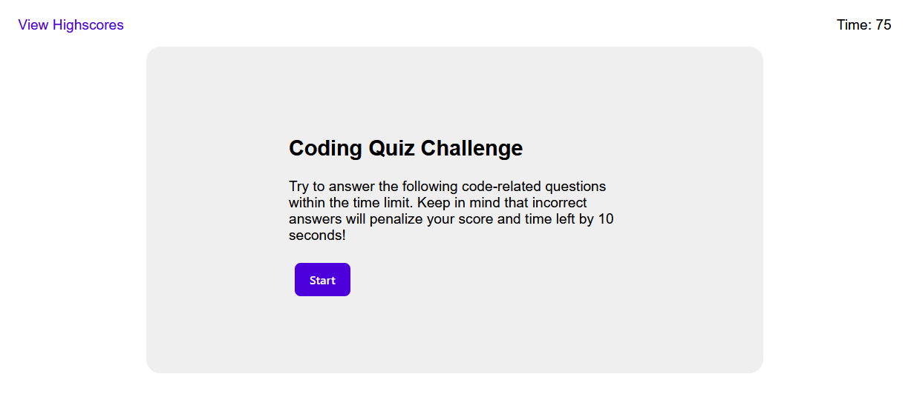

# Coding Quiz

## Description

This a quiz consisting of 5 total questions. The user is given 75 seconds to complete the quiz. This was done using `setInterval()`. Each wrong answer will decrement the timer (which is also the user's score) by a penalty of 10 seconds. I used the `addEventListener` method to add functionality to the buttons (Start, Go Back, Clear Scores) and multiple choice options for the questions. I took advantage of JavaScript to dynamically update the HTML and interact with the DOM using methods like `createElement`, `setAttribute`, and `appendChild`. The user is given the ability to save their score and view a leaderboard. The scores persist and are saved to the browser's `localStorage`.

## Application Link

https://jakubcic.github.io/code-quiz/

## Application Preview

